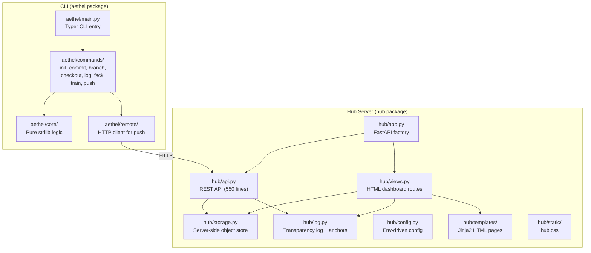

# Aethel Repository — Current State & Demo Guide

## What Is Aethel?

Aethel is a **Git-like version control system for LoRA adapters** (lightweight AI model fine-tuning patches). Instead of storing entire 250 MB models, it stores only the ~0.6 MB LoRA patches on top of a frozen base model (referenced by its immutable Hugging Face SHA).

The system has two major pieces:
1. **CLI tool** (`aethel`) — local version control (init, train, commit, branch, checkout, log, fsck, push)
2. **Hub server** (`hub/`) — a FastAPI web server with a REST API + HTML dashboard for publishing and inspecting adapter provenance

---

## Architecture Overview



---

## Component Breakdown

### 1. Core Engine — `aethel/core/` (Pure Python, no ML deps)

| File | Purpose |
|---|---|
| [hashing.py](file:///home/sathwik/zzz/Capstone/Aethel/aethel/core/hashing.py) | SHA-256 + canonical JSON serialization |
| [atomic.py](file:///home/sathwik/zzz/Capstone/Aethel/aethel/core/atomic.py) | Crash-safe writes (temp → fsync → rename → fsync dir) |
| [objects.py](file:///home/sathwik/zzz/Capstone/Aethel/aethel/core/objects.py) | Content-addressed object store (blobs, trees, commits, bases) |
| [refs.py](file:///home/sathwik/zzz/Capstone/Aethel/aethel/core/refs.py) | HEAD and branch management |
| [commits.py](file:///home/sathwik/zzz/Capstone/Aethel/aethel/core/commits.py) | Commit creation and history traversal |
| [repo.py](file:///home/sathwik/zzz/Capstone/Aethel/aethel/core/repo.py) | Repository discovery and layout |
| [aggregator.py](file:///home/sathwik/zzz/Capstone/Aethel/aethel/core/aggregator.py) | Merkle tree (RFC 6962 domain separation) |
| [errors.py](file:///home/sathwik/zzz/Capstone/Aethel/aethel/core/errors.py) | Exception hierarchy |

### 2. CLI Commands — `aethel/commands/`

| Command | File | What it does |
|---|---|---|
| `aethel init` | [init.py](file:///home/sathwik/zzz/Capstone/Aethel/aethel/commands/init.py) | Creates `.aethel/`, pins a HF model revision |
| `aethel train` | [train.py](file:///home/sathwik/zzz/Capstone/Aethel/aethel/commands/train.py) | LoRA fine-tuning, stages adapter to workspace (needs `[ml]` extra) |
| `aethel commit` | [commit.py](file:///home/sathwik/zzz/Capstone/Aethel/aethel/commands/commit.py) | Snapshots workspace into a commit object |
| `aethel branch` | [branch.py](file:///home/sathwik/zzz/Capstone/Aethel/aethel/commands/branch.py) | List/create/delete branches |
| `aethel checkout` | [checkout.py](file:///home/sathwik/zzz/Capstone/Aethel/aethel/commands/checkout.py) | Restore workspace from branch/commit |
| `aethel log` | [log.py](file:///home/sathwik/zzz/Capstone/Aethel/aethel/commands/log.py) | Show commit history with accuracy |
| `aethel fsck` | [fsck.py](file:///home/sathwik/zzz/Capstone/Aethel/aethel/commands/fsck.py) | Re-hash every object, verify integrity |
| `aethel push` | [push.py](file:///home/sathwik/zzz/Capstone/Aethel/aethel/commands/push.py) | Publish branch to a Hub server |

### 3. Hub Server — `hub/`

A **FastAPI** web application with two interfaces:

#### REST API ([api.py](file:///home/sathwik/zzz/Capstone/Aethel/hub/api.py))
- `PUT /api/v1/blobs/{hash}` — upload blob
- `PUT /api/v1/{kind}/{hash}` — upload commit/tree/base objects
- `POST /api/v1/repos/{name}/negotiate` — incremental sync
- `POST /api/v1/repos/{name}/refs` — advance branch + append to transparency log
- `GET /api/v1/repos`, `/api/v1/commits/{hash}`, `/api/v1/blobs/{hash}`, etc.
- `GET /api/v1/log` — transparency log state
- `GET /api/v1/log/proof/{hash}` — Merkle inclusion proof
- `GET /api/v1/health` — per-subsystem health check
- `GET /api/v1/version`

#### Web Dashboard ([views.py](file:///home/sathwik/zzz/Capstone/Aethel/hub/views.py)) — 4 HTML pages:

| Page | URL | Template | What it shows |
|---|---|---|---|
| **Landing** | `/` | [index.html](file:///home/sathwik/zzz/Capstone/Aethel/hub/templates/index.html) | All repos, KPI tiles (repos, commits, blobs, bases, log entries), transparency log root |
| **Repository** | `/r/{name}` | [repo.html](file:///home/sathwik/zzz/Capstone/Aethel/hub/templates/repo.html) | Stat tiles, **SVG accuracy chart** over versions, version history table with DAG markers |
| **Commit** | `/c/{hash}` | [commit.html](file:///home/sathwik/zzz/Capstone/Aethel/hub/templates/commit.html) | Provenance card, base model, files with download links, **Merkle inclusion proof** |
| **Operations** | `/ops` | [ops.html](file:///home/sathwik/zzz/Capstone/Aethel/hub/templates/ops.html) | Per-subsystem health table, object store counts, log root, data directory |

All styled by [hub.css](file:///home/sathwik/zzz/Capstone/Aethel/hub/static/hub.css) (11.8 KB).

### 4. Tests — 200 tests, ~2s, no GPU

| Test file | Count | Covers |
|---|---|---|
| [test_core_refs.py](file:///home/sathwik/zzz/Capstone/Aethel/tests/test_core_refs.py) | 52 | HEAD, branches, validation |
| [test_core_merkle.py](file:///home/sathwik/zzz/Capstone/Aethel/tests/test_core_merkle.py) | 29 | Domain separation, proofs |
| [test_core_objects.py](file:///home/sathwik/zzz/Capstone/Aethel/tests/test_core_objects.py) | 29 | Store, dedup, integrity |
| [test_core_hashing.py](file:///home/sathwik/zzz/Capstone/Aethel/tests/test_core_hashing.py) | 24 | Canonical JSON, SHA-256 |
| [test_core_commits.py](file:///home/sathwik/zzz/Capstone/Aethel/tests/test_core_commits.py) | 23 | Creation, lineage |
| [test_core_atomic.py](file:///home/sathwik/zzz/Capstone/Aethel/tests/test_core_atomic.py) | 18 | Crash safety, locking |
| [test_core_resolve.py](file:///home/sathwik/zzz/Capstone/Aethel/tests/test_core_resolve.py) | 15 | Branch/hash resolution |
| [test_s1_corruption.py](file:///home/sathwik/zzz/Capstone/Aethel/tests/test_s1_corruption.py) | 10 | Metadata-collision regression |

### 5. Training Configs — `train_yaml/`

Pre-built YAML configs for 5 NLP datasets: SST-2, Rotten Tomatoes, Emotion, AG News, Tweet-Eval Hate.

---

## How to Run the Full Demo

### Prerequisites

```bash
cd /home/sathwik/zzz/Capstone/Aethel

# 1. Create venv & install base + dev
python3 -m venv .venv
source .venv/bin/activate
pip install -e ".[dev]"

# 2. Install ML stack (needed for training — large download)
pip install -e ".[ml]"

# 3. Install Hub dependencies
pip install -e ".[hub]"

# 4. Download demo datasets (~800 samples each)
python setup_demo_data.py
```

### Part A — CLI Demo (the version control story)

```bash
# Create a demo workspace
mkdir demo && cd demo

# Phase 1: Initialize
aethel init --model distilbert-base-uncased

# Phase 2: Train & commit SST-2 sentiment
aethel train --config ../train_yaml/sst2_config.yaml
aethel commit -m "SST-2 sentiment baseline"
aethel log

# Phase 3: Second version (more epochs)
aethel train --config ../train_yaml/sst2_config.yaml
aethel commit -m "SST-2 more epochs"
aethel log

# Phase 4: Branch to different task
aethel branch emotion
aethel checkout emotion
aethel train --config ../train_yaml/emotion_config.yaml
aethel commit -m "Emotion 6-class"
aethel log --all

# Phase 5: Time travel
aethel checkout main       # sentiment adapter is back
aethel checkout emotion    # emotion adapter is back

# Phase 6: Integrity
aethel fsck                # "Repository integrity OK."
```

### Part B — Hub Dashboard Demo (the web UI story)

> [!IMPORTANT]
> Run this in a **separate terminal** while keeping the CLI demo directory available.

```bash
cd /home/sathwik/zzz/Capstone/Aethel
source .venv/bin/activate

# Start the Hub server (port 8000 by default)
uvicorn hub.app:build --factory --host 0.0.0.0 --port 8000
```

Then **push** from the CLI demo directory (in another terminal):

```bash
cd /home/sathwik/zzz/Capstone/Aethel/demo
source ../.venv/bin/activate

# Push main branch
aethel push --remote http://localhost:8000 --repo my-model

# Push emotion branch
aethel push --remote http://localhost:8000 --repo my-model --branch emotion
```

### Part C — Browse the Dashboard Pages

Open a browser and visit:

| URL | Page | What you'll see |
|---|---|---|
| `http://localhost:8000/` | **Landing** | `my-model` repo card with version count, accuracy |
| `http://localhost:8000/r/my-model` | **Repository** | Accuracy trend chart, version history table, DAG markers |
| `http://localhost:8000/c/<commit-hash>` | **Commit** | Provenance, base model, files, Merkle inclusion proof |
| `http://localhost:8000/ops` | **Operations** | Health checks (object store ✓, integrity ✓, log ✓, chain ⚠, IPFS ⚠) |
| `http://localhost:8000/api/v1/health` | **Health JSON** | Machine-readable health status |
| `http://localhost:8000/api/v1/log` | **Log JSON** | Transparency log with entries and Merkle root |

---

## What's Working vs. Planned

### ✅ Working Now
- Full local VCS: init, train, commit, branch, checkout, log, status, fsck
- Push to Hub (incremental sync with negotiate step)
- Hub REST API (objects, repos, commits, log, proofs, health)
- Hub HTML dashboard (4 pages with SVG charts, provenance cards)
- Merkle transparency log with inclusion proofs
- 200 tests, 96% core coverage

### 🔲 Planned (not yet implemented)
- Adapter `diff` and `merge` (task arithmetic, TIES, DARE)
- Ed25519 commit signing
- Dataset fingerprinting
- Anchoring the Merkle log root to a public blockchain testnet
- IPFS mirroring of blobs

> [!NOTE]
> The **chain** and **IPFS** rows on the ops board will show ⚠ warnings — that's expected. They report "not configured" because those features are designed but not yet wired in. The ops board is deliberately built to surface missing infrastructure honestly rather than hiding it.
